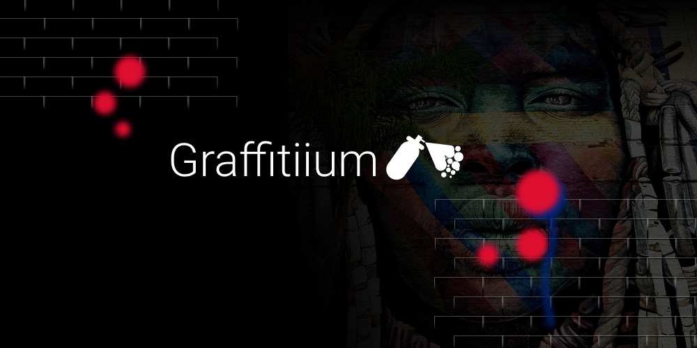
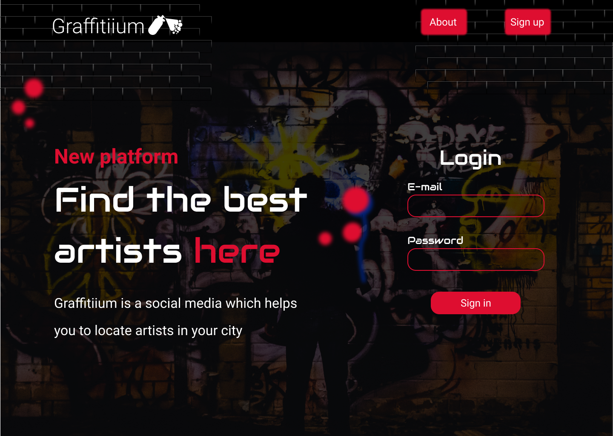
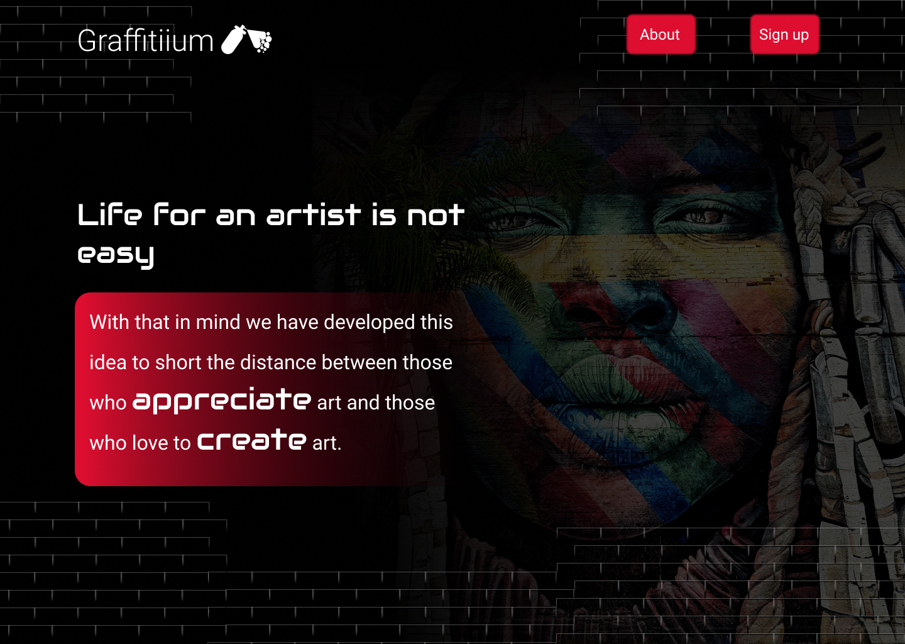
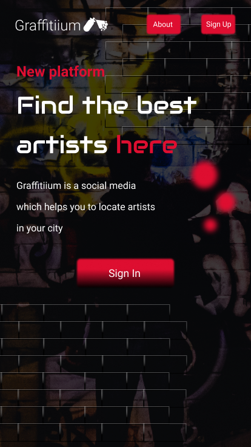
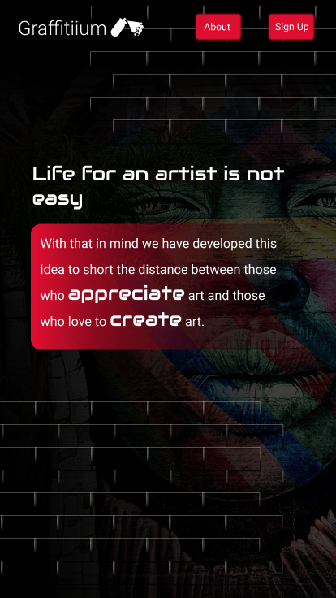
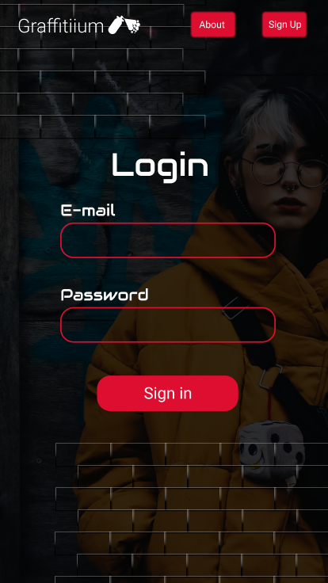

  

---

### Graffitiium is a social media which helps you to locate artists in your city, with that in mind we have developed this idea to short the distance between those who appreciate art and those who love to create art.

# :computer: Web

<table style="width:100%">
  <tr>

  <td align="center"></td>

  <td align="center"></td>

  </tr>
</table>

---

# :iphone: Mobile

<table style="width:100%">
  <tr>

  <td align="center"></td>

  <td align="center"></td>

  <td align="center"></td>

  </tr>
</table>

# :sparkles: Technologies

This project was built using the follow technologies:

- [Typescript](https://www.typescriptlang.org/)
- [React](https://reactjs.org/)
- [React-Router-Dom](https://reactrouter.com/web/guides/quick-start)

# :smiley_cat: Page:

https://graffitiium-git-main.hercules-sousa.vercel.app/
